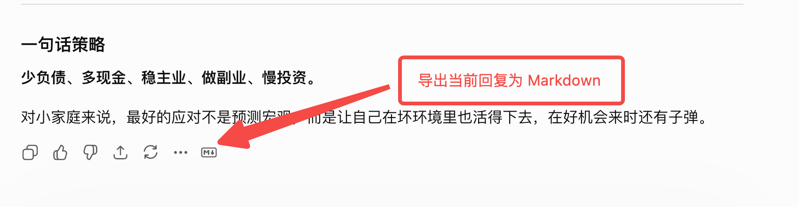
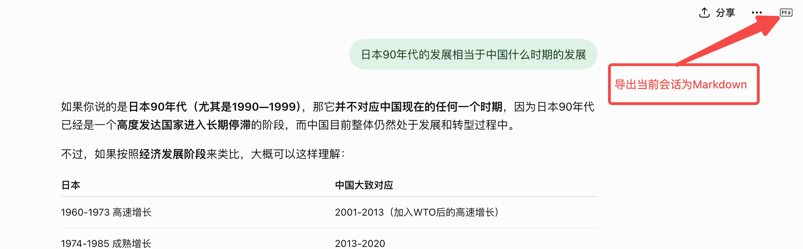

# ChatDown

Save single ChatGPT messages or entire conversation sessions as Markdown (.md) files or rich-text PNG (.png) images with one click.

## Screenshots

### Single Message Export



### Entire Session Export



## Features

- **Export Single Message**: Injects a Markdown export icon into each ChatGPT response action bar, leveraging ChatGPT's native clipboard copy capabilities for maximum accuracy.
- **Export Entire Session**: Injects a global export icon into the header action bar (`#conversation-header-actions`) to save the entire conversation history.
- **High-Fidelity DOM Parser**: Includes a built-in, lightweight HTML-to-Markdown engine that supports paragraphs, headings, blockquotes, lists (ordered/unordered), code blocks, GFM tables, and KaTeX mathematical formulas.
- **Automatic Naming**: Automatically names downloaded files using the active conversation title and a timestamp.
- **Multilingual UI Support** (`chatgpt.com` / `chat.openai.com`).

## Installation

1. Clone or download this repository
2. Open your Chromium-based browser (Chrome, Edge, Arc, etc.) and go to the extensions page:
   - Chrome: `chrome://extensions`
   - Edge: `edge://extensions`
3. Enable **Developer mode**
4. Click **Load unpacked** and select the project root directory

## Usage

1. Open [ChatGPT](https://chatgpt.com) and go to any conversation.
2. **Export Single Message**: Find and click the Markdown icon button in the action bar below each response.
3. **Export Entire Session**: Find and click the global Markdown icon button in the top-right header actions bar (next to the share button).
4. The browser will automatically download the corresponding `.md` file.

Hover over the buttons for a tooltip. Success, failure, and busy states are shown via tooltips.

## How It Works

The extension watches DOM changes and dynamically injects export buttons. When clicked:

- **Single Message Export**:
  1. Triggers ChatGPT's native Copy button for the message.
  2. Reads the generated Markdown from the system clipboard.
  3. Creates a Blob and downloads it locally.
- **Entire Session Export**:
  1. Enumerates all chat turns (including user prompts and assistant responses) in the page.
  2. Recursively parses the DOM tree using the built-in formatter, mapping formatting elements (paragraphs, tables, lists, code, LaTeX math) into Markdown.
  3. Combines all parts and downloads the `.md` file. (This process runs entirely client-side and does not alter the user's system clipboard).

## Project Structure

```
chatgpt-export-md/
├── manifest.json          # Extension configuration
├── content.js             # Button injection and export logic
├── style.css              # Button styles
├── icons/                 # Extension icons
│   ├── icon.svg
│   ├── icon16.png
│   ├── icon32.png
│   ├── icon48.png
│   └── icon128.png
└── scripts/
    └── generate-icons.mjs # Generate PNG icons from SVG
```

## Development

Regenerate icons (install dependencies first):

```bash
npm install sharp
node scripts/generate-icons.mjs
```

After changing code, click **Reload** on the extensions page to apply updates.

## Permissions

| Permission       | Purpose                                                             |
| ---------------- | ------------------------------------------------------------------- |
| `clipboardWrite` | Used with the copy flow to read Markdown content from the clipboard |

## Compatibility

- Manifest V3
- Supports `https://chatgpt.com/*` and `https://chat.openai.com/*`

## License

MIT
